# Sales Hub - Sistema Completo de Gestão de Vendas


---

## 📌 Visão Geral

O **Sales Hub** é um sistema completo para gestão comercial desenvolvido em Django que oferece:

- **PDV Completo** com emissão de documentos.
- **Controle de Estoque Avançado**.
- **Dashboard Analítico em Tempo Real**.
- **Sistema de Permissões Personalizável**.

---

## ✨ Funcionalidades Principais

### 🛒 Módulo de Vendas
- PDV integrado com emissão de comprovante em PDF.
- Geração de orçamentos convertíveis em pedidos.
- Pedidos de venda com assinatura digital do cliente.
- Controle de comissões por vendedor.

### 📦 Gestão de Estoque
- Cadastro completo de produtos, marcas e fornecedores.
- Controle de entradas e saídas com histórico.
- Cálculo automático de custos e margens.
- Alertas de estoque mínimo.

### 📊 Business Intelligence
- Dashboard com métricas essenciais:
  - Performance individual de vendedores.
  - Top 10 clientes e produtos.
  - Evolução de vendas diárias/semanais/mensais.
  - Análise de giro de estoque.

### 🔒 Segurança e Acessos
- Controle de acesso por perfis customizáveis.
- Autenticação via JWT (JSON Web Tokens).
- API REST protegida para integrações.

---

## 🛠 Stack Tecnológica

### Backend:
- **Python 3.10+**
- **Django 5.1**
- **Django REST Framework**
- **ReportLab** (geração de PDFs)
- **Pillow** (processamento de imagens)

### Frontend:
- **Bootstrap 5**
- **Chart.js** (visualização de dados)
- **jQuery** (interações dinâmicas)
- **Crispy Forms** (formulários otimizados)

### Banco de Dados:
- **SQLite** (desenvolvimento)
- **PostgreSQL** (produção recomendada)

---

## 🚀 Instalação e Configuração

### Pré-requisitos
- **Python 3.10 ou superior**
- **Git instalado**
- **Virtualenv** (recomendado)

### Clonar repositório
  ```bash
git clone https://github.com/KaioHerculano/Sales_Hub.git
   ```
  ```bash
cd Sales_Hub
   ```
### Clonar repositório
  ```bash
python -m venv venv
   ```
# Linux/Mac:
  ```bash
source venv/bin/activate
   ```
# Windows:
  ```bash
venv\Scripts\activate
   ```
### Instalar dependências
  ```bash
pip install -r requirements.txt
   ```
### Configurar banco de dados
  ```bash
python manage.py migrate
   ```
### Criar superusuário
  ```bash
python manage.py createsuperuser
   ```
### Iniciar servidor
  ```bash
python manage.py runserver
   ```
### Acessar sistema

Aplicação: 
  ```bash
http://localhost:8000
  ```
Admin:
  ```bash
http://localhost:8000/admin
  ```
### 📚 Documentação
## API Endpoints
- **/api/v1/ - Endpoint base para integrações.**
- **Documentação Swagger disponível em /api/docs/ após configuração.**

## 📷 Capturas de Tela

### 📱 Login:
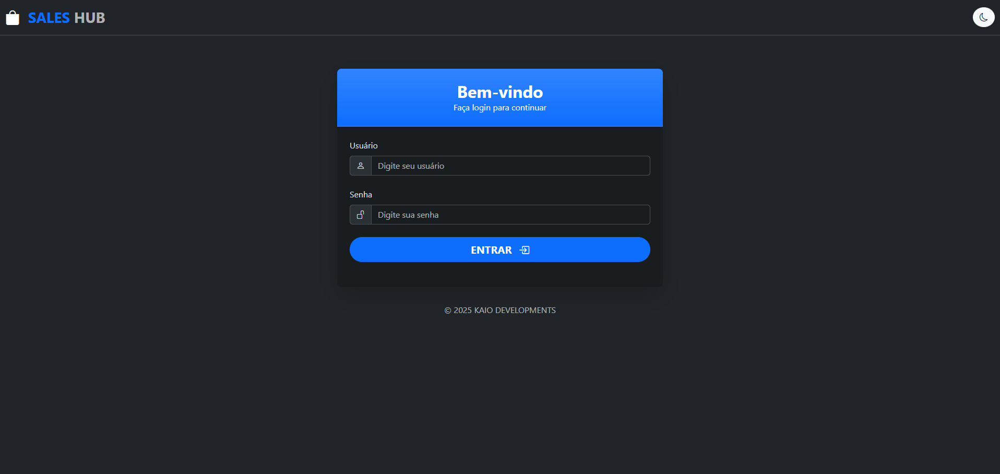

### 📊 Dashboard:
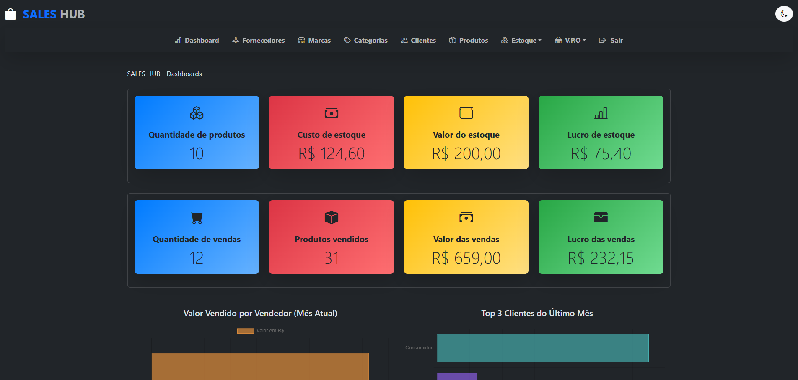
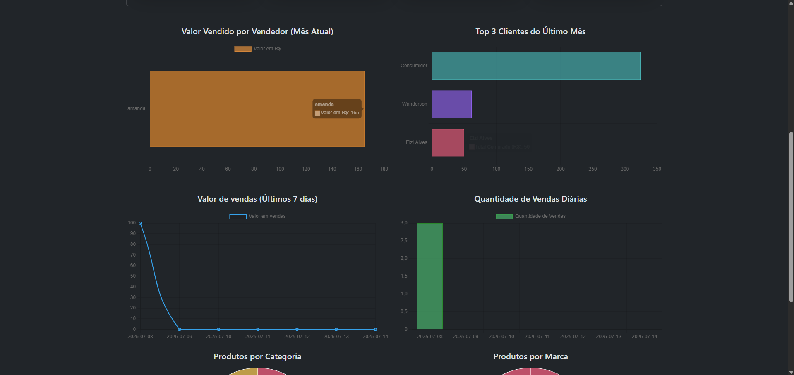
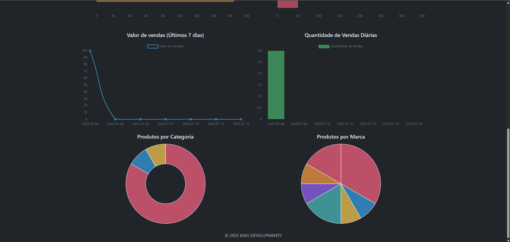

### ✈️ Lista de Fornecedores:
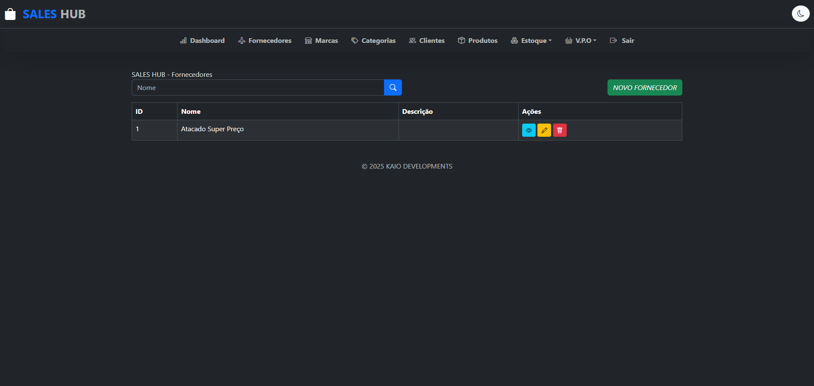

### 🏠 Lista de Marcas:
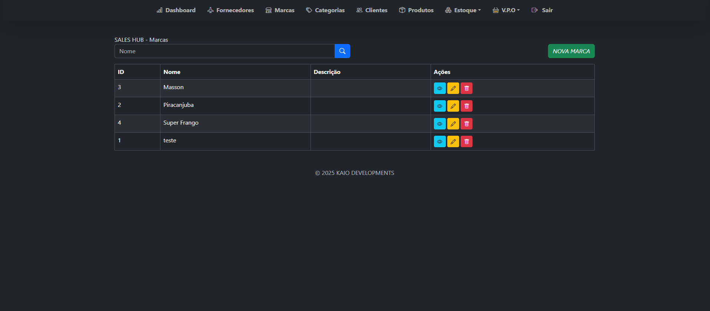

### 🏷️ Lista de Categorias:
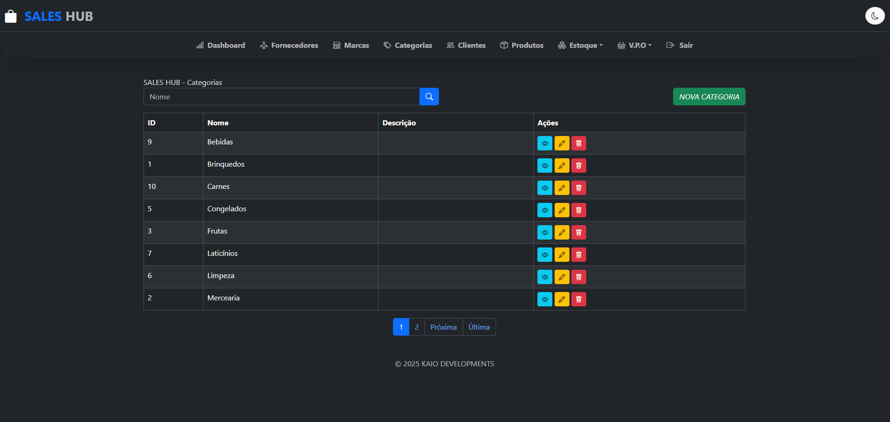

### 🚻 Lista de Clientes:
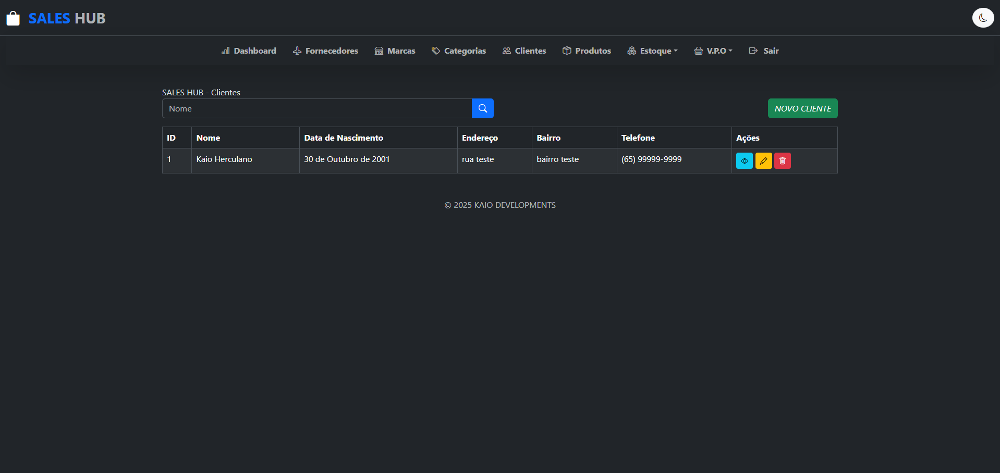

### 📦 Lista de Produtos:
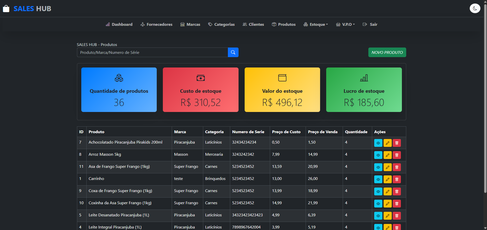

### 📦 Estoque:
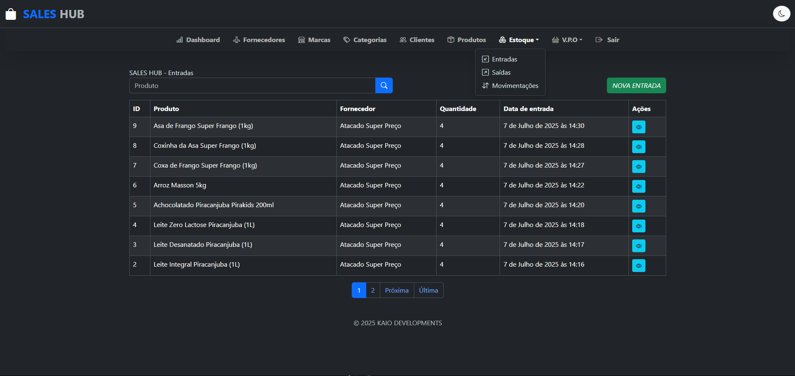

### 🛍️ Vendas:
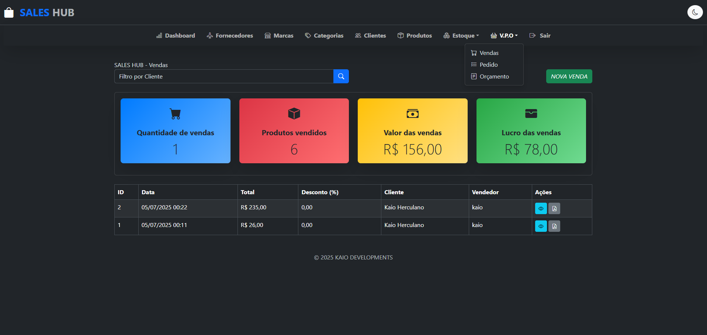
